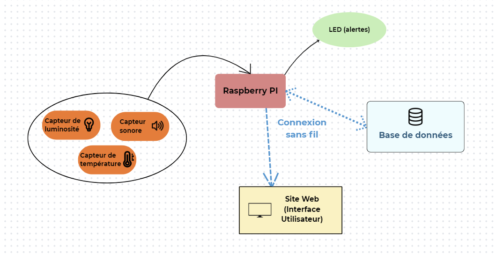

### DESKMATE

Le projet **Deskmate** consiste à développer un système intelligent de surveillance des conditions environnementales pour les espaces intérieurs (bureaux, salles de classe, domicile).
L'objectif principal est d'optimiser le confort des occupants en surveillant trois paramètres clés : _le niveau sonore, la température et la luminosité_. Le système vise à soulager l'utilisateur d'une surveillance constante en alertant uniquement lorsque les seuils de confort définis sont dépassés.

## SCHEMA GENERAL DU PROJET :

Le cœur du système est le Raspberry Pi. Sa sélection répond à la contrainte d’utiliser au moins un capteur et permet l’intégration facile des modules utilisés. De plus, pour respecter la contrainte d’enregistrement des données dans une base de données, le Raspberry Pi stockera l’historique des mesures, alertes déclenchées et des évènements du minuteur assurant un suivi sur le long terme. Par ailleurs, la contrainte d’utilisation d’un site web est mise en œuvre en configurant le Raspberry Pi comme un serveur. Grâce à son module Wi-Fi, il rend l’interface de contrôle et de visualisation accessible depuis n’importe quel dispositif *(téléphone, ordinateur)*. Enfin, l’interaction avec un humain est gérée à plusieurs niveaux. L’utilisateur peut configurer les seuils critiques et gérer le minuteur via l’interface web.

La figure 1 représente le fonctionnement du Deskmate. Il se compose des éléments suivants :

- __Capteurs :__ L’acquisition des données environnementales repose sur trois capteurs principaux: le *Grove - Sound Sensor* (le niveau sonore), le *Grove - Temperature Sensor* (la température) et le *Grove - Light Sensor* (la luminosité).
- __Actionneur :__ Une *Grove - LED* est utilisée comme alerte visuelle. Elle s'allume pour avertir l'utilisateur lorsque l'une des limites définies est dépassée.
- __Raspberry Pi :__ Le cœur du système qui centralise les données provenant de *trois capteurs Grove*.
- __Base de données :__ Le *Raspberry Pi* stocke l'historique des mesures, les alertes déclenchées et les événements liés au minuteur dans une base de données, permettant un suivi sur le long terme.
- __Site Web :__ Le *Raspberry Pi* est configuré comme serveur web accessible via Wi-Fi, permettant de visualiser les données et de contrôler le dispositif depuis un ordinateur ou un smartphone.

*Figure 1 - Schéma général du concept du Deskmate*

## SCÉNARIOS D’USAGE :

1. L’utilisateur sélectionne dans un menu la température la plus haute et celle la plus basse souhaitée.
2. Le raspberry mesure la température à un moment fixe et vérifie si elle est comprise entre l’écart de températures donné par l’utilisateur. Dans le cas où elle n’est pas comprise dans l’écart, un message d’alerte est envoyé sur le site web.
3. L’utilisateur sélectionne dans un menu le niveau de son maximum à ne pas dépasser.
4. Le raspberry mesure le niveau de son à un moment fixe et vérifie s’il est en dessous du seuil donné par l’utilisateur. Dans le cas où il lui est supérieur, un message d’alerte est envoyé sur le site web.
5. Le raspberry vérifie périodiquement le niveau de luminosité. Si celle-ci est trop basse, un message d’alerte est envoyé sur le site web.
6. Grâce à un menu ou bien au bouton, l’utilisateur peut activer un minuteur réglé au temps voulu.
